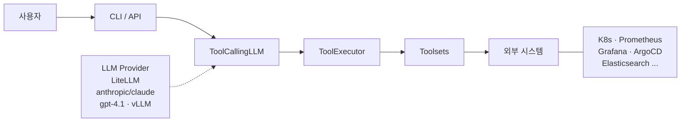
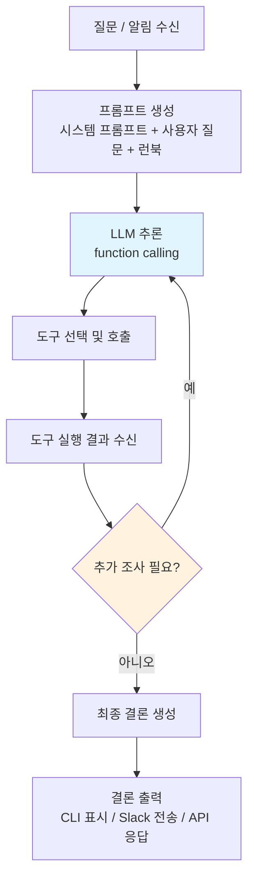
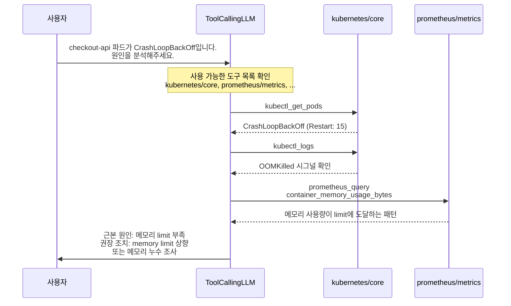

# HolmesGPT 아키텍처

이 문서는 HolmesGPT의 내부 아키텍처를 설명합니다. 기업 환경에서 배포할 때 각 컴포넌트가 어떻게 연결되는지 이해하는 데 도움이 됩니다.

---

## 시스템 아키텍처

HolmesGPT는 사용자의 질문이나 알림을 받아 LLM 기반 에이전틱 루프를 통해 외부 시스템에서 데이터를 수집하고, 근본 원인을 분석한 뒤 결론을 도출합니다.



각 컴포넌트의 역할은 다음과 같습니다.

- **CLI/API**: 사용자 요청을 받는 진입점입니다. `ask` (단일 질문), `investigate` (알림 조사), `toolset` (도구셋 관리) 서브커맨드를 제공합니다.
- **ToolCallingLLM**: LLM과의 대화 및 도구 호출을 관리하는 핵심 엔진입니다. LiteLLM을 통해 OpenAI, Anthropic, Azure, vLLM 등 다양한 LLM 제공자를 지원합니다.
- **ToolExecutor**: LLM이 선택한 도구를 실행하고 결과를 반환합니다. 응답 크기 제한, 반복 호출 방지 등의 안전장치를 포함합니다.
- **Toolsets**: 외부 시스템과 통신하는 도구 모음입니다. YAML, HTTP, Python 세 가지 유형이 있습니다.

---

## 에이전틱 조사 루프

HolmesGPT의 핵심은 LLM이 스스로 어떤 도구를 호출할지 결정하는 에이전틱 루프입니다. 단순 프롬프트-응답이 아니라, 반복적으로 도구를 호출하며 점진적으로 문제를 진단합니다.



주요 특성은 다음과 같습니다.

- **최대 스텝 수**: `max_steps` 설정으로 제어합니다 (기본값 40).
- **컨텍스트 누적**: 각 스텝에서 이전 도구 호출 결과가 컨텍스트에 포함됩니다. LLM은 이전 결과를 참조하여 다음 조사 방향을 결정합니다.
- **자동 도구 선택**: LLM이 사용 가능한 도구 목록을 보고 어떤 도구를 호출할지 스스로 결정합니다 (function calling).
- **응답 크기 제한**: 도구 실행 결과가 너무 클 경우 자동으로 잘라내어 컨텍스트 윈도우를 보호합니다.
- **반복 호출 방지**: 같은 도구를 동일한 파라미터로 반복 호출하는 것을 감지하고 차단합니다.

---

## 도구셋 3가지 타입

도구셋(Toolset)은 HolmesGPT가 외부 시스템에서 데이터를 수집하는 수단입니다. 기업 환경에 맞는 타입을 선택하여 사내 시스템을 연동할 수 있습니다.

### YAML 도구셋 (Command-based)

가장 일반적인 유형으로, bash 명령어를 실행하여 데이터를 수집합니다.

```yaml
toolsets:
  argocd/core:
    description: "Set of tools to get argocd metadata"
    llm_instructions: |
      You have access to ArgoCD tools for debugging
      Kubernetes application deployments.
    tags:
      - core
    prerequisites:
      - command: "argocd version"
      - env:
          - ARGOCD_AUTH_TOKEN
    tools:
      - name: "argocd_app_list"
        description: "List the applications in ArgoCD"
        command: "argocd app list"

      - name: "argocd_app_get"
        description: "Retrieve information about an application"
        command: "argocd app get {{ app_name }} --show-operation -o wide"
```

주요 구성 요소는 다음과 같습니다.

- **prerequisites**: 도구셋 사용 전 사전 조건을 검증합니다. CLI 설치 여부(`command`)나 환경변수 존재 여부(`env`)를 확인합니다.
- **llm_instructions**: LLM에게 도구 사용 방법을 안내하는 지시문입니다. 어떤 순서로 도구를 호출해야 하는지 구체적으로 명시할 수 있습니다.
- **command**: Jinja2 템플릿 문법으로 파라미터를 주입합니다 (`{{ param }}`). 환경변수는 `${VAR}` 형식으로 참조합니다.

### HTTP 도구셋 (API-based)

REST API를 직접 호출하는 유형입니다. 엔드포인트 화이트리스트로 보안을 제어합니다.

```yaml
toolsets:
  jupyterhub-api:
    type: http
    enabled: true
    config:
      endpoints:
        - hosts:
            - "jupyterhub.internal.company.com"
          paths: ["/hub/api/*"]
          methods: ["GET"]
          auth:
            type: bearer
            token: "{{ env.JUPYTERHUB_TOKEN }}"
      verify_ssl: true
      timeout_seconds: 30
    llm_instructions: |
      JupyterHub API를 통해 사용자 세션과 서버 상태를
      조회할 수 있습니다.
      Base URL: {{ env.JUPYTERHUB_URL }}
```

지원하는 인증 방식은 다음과 같습니다.

- **Basic Auth**: 사용자명과 비밀번호 기반 인증
- **Bearer Token**: API 토큰 기반 인증
- **Custom Header**: 커스텀 헤더를 통한 인증

### Python 도구셋

복잡한 로직이나 API 클라이언트 라이브러리가 필요한 경우 Python으로 도구셋을 구현합니다. Prometheus, Grafana, Elasticsearch 등의 내장 도구셋이 이 방식을 사용합니다.

```
holmes/plugins/toolsets/
    prometheus/
        prometheus.py       # Python 도구셋 구현
    grafana_dashboards/
        grafana_dashboards.py
    elasticsearch/
        elasticsearch.py
```

Python 도구셋의 특징은 다음과 같습니다.

- **Pydantic 설정 클래스**: 설정값의 타입 검증 및 기본값 관리
- **Health check**: `prerequisites_callable()` 메서드로 연결 상태 사전 검증
- **Thin API wrapper 패턴**: `requests` 라이브러리를 사용한 경량 HTTP 클라이언트 구현

---

## 런북 시스템

런북(Runbook)은 특정 장애 유형에 대한 조사 절차를 코드화한 문서입니다. LLM이 알림을 조사할 때 관련 런북을 참조하여 체계적으로 진단합니다.

### 구조

```
holmes/plugins/runbooks/
    catalog.json              # 런북 메타데이터 (제목, 설명, 관련 알림)
    networking/
        dns-resolution.md     # 개별 런북 파일
    database/
        connection-pool.md
```

`catalog.json`은 런북 색인 역할을 합니다. 각 항목은 런북의 ID, 제목, 증상 설명, 관련 알림 이름을 포함합니다. LLM은 현재 조사 대상과 관련된 런북만 on-demand로 로드합니다.

### 런북 마크다운 형식

각 런북은 다음 네 가지 섹션으로 구성됩니다.

1. **Goal**: 이 런북이 다루는 장애 유형과 범위를 정의합니다.
2. **Workflow**: LLM이 순차적으로 실행할 진단 단계를 번호 매기기로 제시합니다. 조건 분기(IF/ELSE)를 포함할 수 있습니다.
3. **Synthesis**: 여러 단계의 결과를 종합하여 근본 원인을 식별하는 방법을 안내합니다.
4. **Remediation**: 즉시 조치 사항과 영구 해결 방안을 제시합니다.

### 커스텀 런북

사내 장애 대응 절차를 커스텀 런북으로 코드화하면, HolmesGPT가 조직 고유의 운영 지식을 활용하여 조사할 수 있습니다.

```yaml
# config.yaml
custom_runbooks:
  - "/etc/holmes/runbooks/catalog.json"
```

---

## 설정 시스템

HolmesGPT는 계층화된 설정 시스템을 사용합니다. 설정 우선순위는 CLI 인수 > 환경변수 > config.yaml > 기본값 순입니다.

### config.yaml

모든 설정의 중심 파일입니다. 기본 경로는 `~/.holmes/config.yaml`입니다.

```yaml
# LLM 설정
model: "anthropic/claude-sonnet-4-5-20250929"
api_key: null  # 환경변수 사용 권장

# 에이전틱 루프 설정
max_steps: 40

# 도구셋 설정
custom_toolsets:
  - "/etc/holmes/toolsets/custom-tools.yaml"

toolsets:
  kubernetes/core:
    enabled: true
  prometheus/core:
    enabled: true
    config:
      prometheus_url: "http://prometheus.monitoring:9090"
  argocd/core:
    enabled: false

# 알림 소스 설정
alertmanager_url: "http://alertmanager.monitoring:9093"

# 런북 설정
custom_runbooks:
  - "/etc/holmes/runbooks/catalog.json"
```

### 환경변수

민감한 정보는 환경변수로 관리합니다.

| 환경변수 | 용도 |
|---|---|
| `OPENAI_API_KEY` | OpenAI API 키 |
| `ANTHROPIC_API_KEY` | Anthropic API 키 |
| `OPENAI_API_BASE` | OpenAI 호환 API 엔드포인트 (vLLM 등) |
| `MODEL` | 사용할 LLM 모델 지정 |
| `OPENROUTER_API_KEY` | OpenRouter를 통한 LLM 접근 |

### Helm values.yaml (Kubernetes 배포)

Kubernetes 환경에서는 Helm chart의 `values.yaml`을 통해 설정을 관리합니다. 설정값은 config.yaml과 동일한 구조로 매핑됩니다.

```yaml
holmes:
  model: "anthropic/claude-sonnet-4-5-20250929"
  env:
    - name: ANTHROPIC_API_KEY
      valueFrom:
        secretKeyRef:
          name: holmes-secrets
          key: anthropic-api-key
  toolsets:
    kubernetes/core:
      enabled: true
    prometheus/core:
      enabled: true
      config:
        prometheus_url: "http://prometheus.monitoring:9090"
  customToolsets:
    my-internal-api:
      type: http
      enabled: true
      config:
        endpoints:
          - hosts: ["internal-api.company.com"]
            paths: ["/api/v1/*"]
            methods: ["GET"]
```

### 도구셋 활성화 및 설정

`toolsets` 섹션에서 각 도구셋의 활성화 여부와 세부 설정을 제어합니다.

```yaml
toolsets:
  # 도구셋 비활성화
  docker/core:
    enabled: false

  # 도구셋 활성화 + 설정 제공
  grafana/dashboards:
    enabled: true
    config:
      api_url: "http://grafana.monitoring:3000"
      api_key: "{{ env.GRAFANA_API_KEY }}"

  # 커스텀 도구셋 파일 경로를 통한 추가
  # custom_toolsets 목록에 파일을 추가합니다
```

도구셋 설정 변경 후에는 `holmes toolset refresh` 명령으로 상태를 갱신할 수 있습니다.

---

## 컴포넌트 간 데이터 흐름

아래 예시는 "왜 checkout-api 파드가 CrashLoopBackOff 상태인가?"라는 질문에 대한 조사 흐름을 보여줍니다.



---

## 보안 설계

HolmesGPT의 모든 도구는 읽기 전용(read-only)으로 설계되어 있습니다.

- **Bash 도구셋**: 명령어 안전성 검증 로직이 포함되어 있습니다.
- **HTTP 도구셋**: 엔드포인트 화이트리스트로 접근 범위를 제한합니다.
- **Kubernetes RBAC**: 클러스터에 설정된 RBAC 권한을 그대로 따릅니다.
- **비밀 정보 관리**: API 키 등의 민감 정보는 환경변수 또는 Kubernetes Secret으로 관리합니다. 설정 파일에 직접 기록하지 않는 것을 권장합니다.
