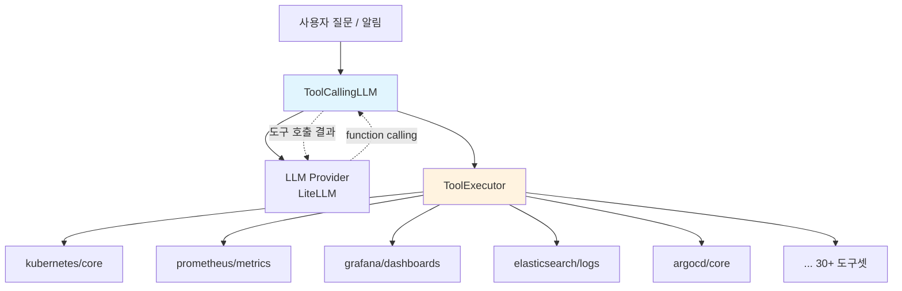
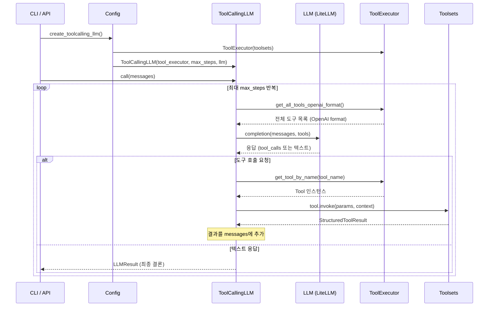
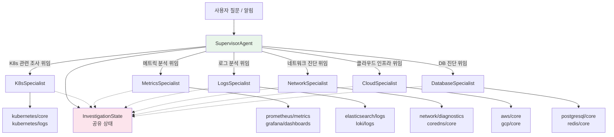
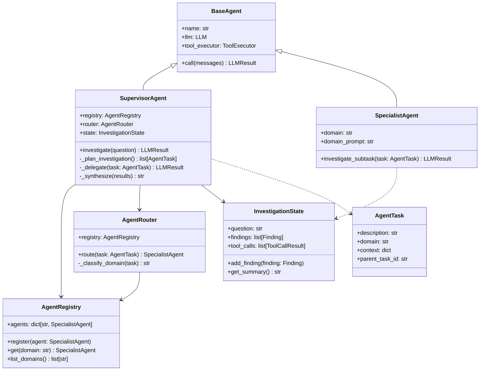
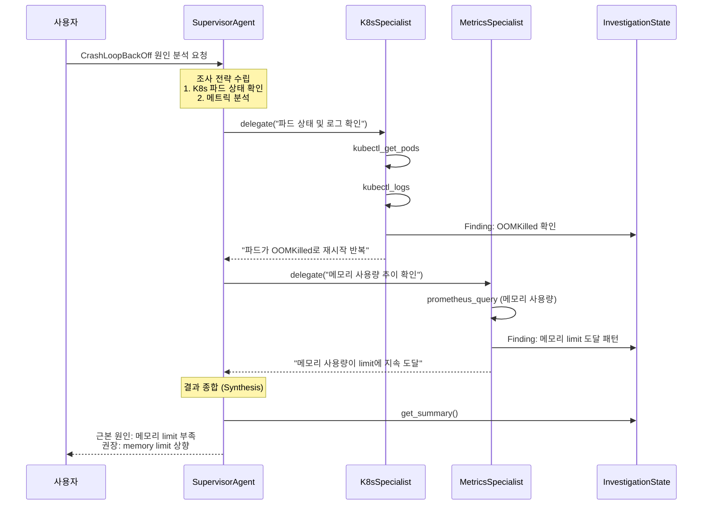
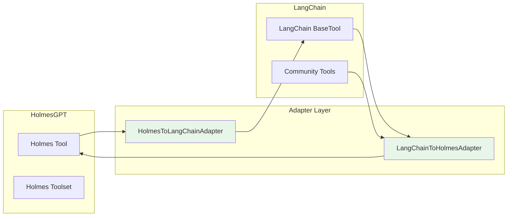
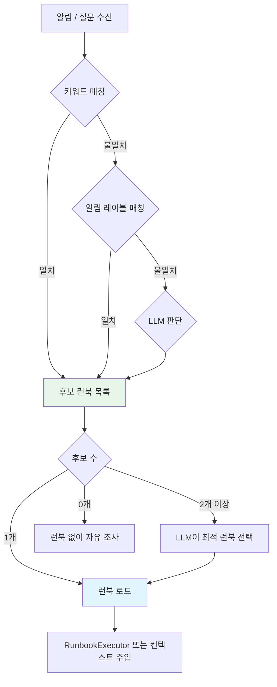
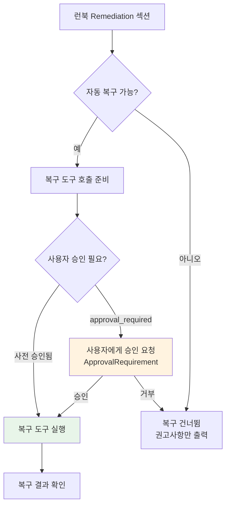
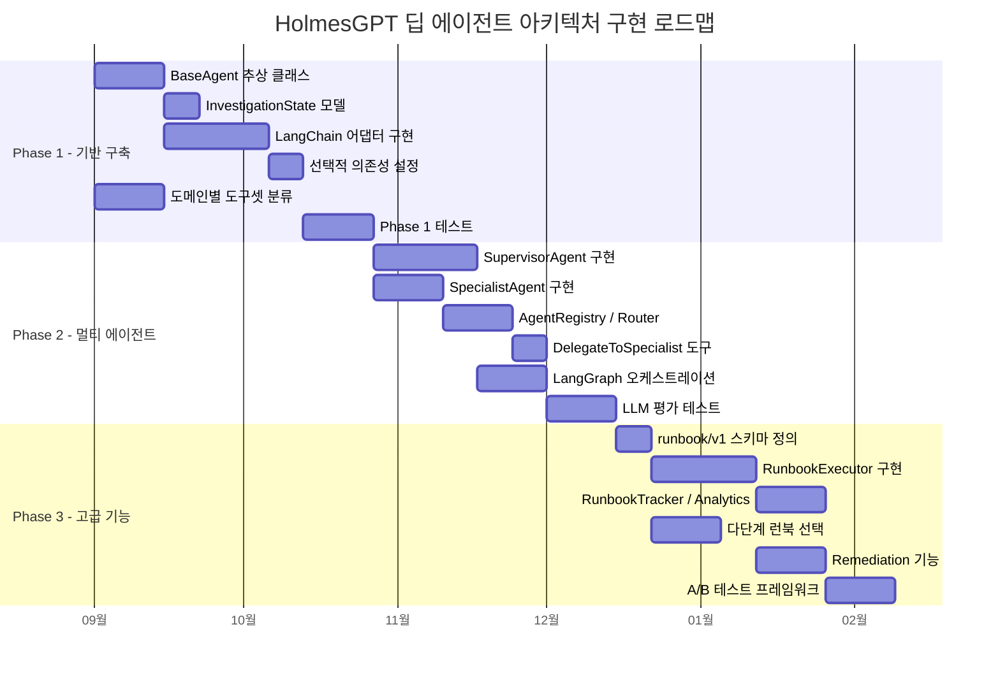

# 딥 에이전트 아키텍처 개선 계획

이 문서는 HolmesGPT의 현재 단일 에이전트 아키텍처를 분석하고, 멀티 에이전트 전환, LangChain 통합, 런북 고도화를 위한 개선 계획을 제시합니다.

---

## 1. 현재 아키텍처 분석

### 단일 에이전트 루프

현재 HolmesGPT는 하나의 `ToolCallingLLM` 인스턴스가 모든 도구를 직접 관리하는 단일 에이전트 구조입니다. LLM이 사용 가능한 전체 도구 목록을 매 호출마다 전달받고, 어떤 도구를 호출할지 스스로 결정합니다.



### 핵심 코드 흐름

조사 요청이 들어오면 다음과 같은 순서로 처리됩니다.



### 핵심 파일 맵

| 파일 | 역할 | 주요 클래스/함수 |
|------|------|------------------|
| `holmes/core/tool_calling_llm.py` | 에이전트 루프 엔진 | `ToolCallingLLM.call()`, `IssueInvestigator.investigate()` |
| `holmes/core/tools.py` | 도구/도구셋 정의 | `Tool`, `Toolset`, `YAMLTool`, `StructuredToolResult` |
| `holmes/core/tools_utils/tool_executor.py` | 도구 실행 관리 | `ToolExecutor.get_all_tools_openai_format()` |
| `holmes/core/toolset_manager.py` | 도구셋 로드/관리 | `ToolsetManager._list_all_toolsets()` |
| `holmes/config.py` | 설정 및 팩토리 | `Config.create_toolcalling_llm()` |
| `holmes/plugins/runbooks/__init__.py` | 런북 카탈로그 | `RunbookCatalog`, `load_runbook_catalog()` |

### 현재 구조의 한계

**컨텍스트 윈도우 비효율**

`ToolExecutor.get_all_tools_openai_format()`은 활성화된 모든 도구를 OpenAI 도구 스키마로 변환하여 매 LLM 호출에 포함합니다. 30개 이상의 도구 정의가 매번 전달되므로, 실제 조사에 필요하지 않은 도구들의 스키마가 프롬프트 토큰을 소비합니다.

**도메인 전문화 부재**

단일 LLM이 Kubernetes, Prometheus, Grafana, Elasticsearch 등 모든 도메인의 도구를 동시에 다룹니다. 각 도메인에 특화된 프롬프트나 조사 전략을 적용할 수 없으며, 도구 수가 증가할수록 LLM의 도구 선택 정확도가 저하될 수 있습니다.

**외부 도구 생태계 통합 어려움**

현재 도구 시스템(`Tool`, `Toolset`)은 HolmesGPT 고유의 인터페이스입니다. LangChain, CrewAI 등 외부 에이전트 프레임워크의 도구를 직접 활용할 수 없으며, 반대로 Holmes 도구를 외부 프레임워크에서 재사용하기도 어렵습니다.

**런북 실행의 한계**

현재 런북은 마크다운 텍스트를 LLM의 컨텍스트에 주입하는 방식입니다. LLM이 런북을 자연어로 해석하므로 단계 건너뛰기, 조건 분기 미이행 등의 문제가 발생할 수 있으며, 실행 추적이나 성공률 분석이 불가능합니다.

---

## 2. 멀티 에이전트 아키텍처

### Supervisor-Specialist 패턴

단일 에이전트를 Supervisor(조율자)와 여러 Specialist(전문가)로 분리합니다. Supervisor가 조사 전략을 수립하고, 각 도메인의 Specialist에게 세부 조사를 위임합니다.



### 에이전트 클래스 설계



### 위임 도구 설계

Supervisor는 `delegate_to_specialist` 도구를 통해 Specialist에게 작업을 위임합니다. 이 도구는 Supervisor의 LLM이 function calling으로 호출하는 일반 도구와 동일한 인터페이스를 갖습니다.

```python
# 의사 코드 - SupervisorAgent의 위임 도구
class DelegateToSpecialist(Tool):
    name = "delegate_to_specialist"
    description = "도메인 전문 에이전트에게 세부 조사를 위임합니다."
    parameters = {
        "domain": ToolParameter(
            description="조사를 위임할 도메인 (kubernetes, metrics, logs, network, cloud, database)",
            type="string",
            enum=["kubernetes", "metrics", "logs", "network", "cloud", "database"],
        ),
        "task_description": ToolParameter(
            description="전문 에이전트가 수행할 구체적인 조사 내용",
            type="string",
        ),
    }

    def _invoke(self, params: dict, context: ToolInvokeContext) -> StructuredToolResult:
        domain = params["domain"]
        task = AgentTask(
            description=params["task_description"],
            domain=domain,
            context=self.state.get_summary(),
        )
        specialist = self.registry.get(domain)
        result = specialist.investigate_subtask(task)
        self.state.add_finding(Finding(domain=domain, content=result.result))
        return StructuredToolResult(
            status=StructuredToolResultStatus.SUCCESS,
            data=result.result,
        )
```

### 도메인-도구셋 매핑

각 Specialist가 관리하는 도구셋과 역할은 다음과 같습니다.

| 도메인 | Specialist | 담당 도구셋 | 역할 |
|--------|-----------|-------------|------|
| kubernetes | K8sSpecialist | `kubernetes/core`, `kubernetes/logs` | 파드/디플로이먼트 상태, 이벤트, 로그 |
| metrics | MetricsSpecialist | `prometheus/metrics`, `grafana/dashboards` | 메트릭 쿼리, 대시보드 분석, 이상 탐지 |
| logs | LogsSpecialist | `elasticsearch/logs`, `loki/logs` | 로그 검색, 패턴 분석, 에러 추출 |
| network | NetworkSpecialist | `network/diagnostics`, `coredns/core` | DNS, 연결성, 네트워크 정책 진단 |
| cloud | CloudSpecialist | `aws/core`, `gcp/core` | 클라우드 리소스 상태, IAM, 네트워크 설정 |
| database | DatabaseSpecialist | `postgresql/core`, `redis/core` | DB 연결, 쿼리 성능, 복제 상태 |

### 기존 단일 에이전트와의 호환성

`agent_mode` 설정을 통해 단일/멀티 에이전트 모드를 선택할 수 있습니다. 기본값은 `single`로 기존 동작을 유지합니다.

```yaml
# config.yaml
agent_mode: single  # single | multi

# 멀티 에이전트 모드 설정
multi_agent:
  enabled_specialists:
    - kubernetes
    - metrics
    - logs
  max_delegation_depth: 2
  parallel_delegation: true
```

```python
# 의사 코드 - Config에 agent_mode 추가
class Config(RobustaBaseConfig):
    agent_mode: str = "single"  # "single" | "multi"

    def create_toolcalling_llm(self, dal=None, model=None, tracer=None):
        tool_executor = self.create_tool_executor(dal)
        llm = self._get_llm(model, tracer)

        if self.agent_mode == "multi":
            return self._create_supervisor_agent(tool_executor, llm)
        else:
            return ToolCallingLLM(tool_executor, self.max_steps, llm)

    def _create_supervisor_agent(self, tool_executor, llm):
        registry = AgentRegistry()
        # 도메인별 Specialist 생성 - 각 Specialist는 해당 도메인의 도구셋만 포함
        for domain, toolset_names in DOMAIN_TOOLSET_MAP.items():
            domain_toolsets = [
                ts for ts in tool_executor.toolsets
                if ts.name in toolset_names and ts.status == ToolsetStatusEnum.ENABLED
            ]
            if domain_toolsets:
                specialist = SpecialistAgent(
                    domain=domain,
                    llm=llm,
                    tool_executor=ToolExecutor(domain_toolsets),
                )
                registry.register(specialist)

        return SupervisorAgent(
            registry=registry,
            llm=llm,
            tool_executor=tool_executor,
            max_steps=self.max_steps,
        )
```

### 조사 흐름 예시

"checkout-api 파드가 CrashLoopBackOff 상태입니다"라는 알림에 대한 멀티 에이전트 조사 흐름입니다.



---

## 3. LangChain 도구 통합

### 통합 목표

HolmesGPT 도구와 LangChain 도구 간의 양방향 어댑터를 구축하여, 두 생태계의 도구를 상호 활용할 수 있도록 합니다.



### Holmes Tool → LangChain BaseTool 어댑터

Holmes 도구를 LangChain의 `BaseTool` 인터페이스로 래핑하여, LangGraph 기반 오케스트레이션이나 LangChain 에이전트에서 사용할 수 있게 합니다.

```python
# 의사 코드 - HolmesToLangChainAdapter
from typing import Optional, Type
from pydantic import BaseModel, Field

# LangChain은 선택적 의존성 (lazy import)
def _import_langchain():
    try:
        from langchain_core.tools import BaseTool as LCBaseTool
        return LCBaseTool
    except ImportError:
        raise ImportError(
            "langchain-core가 필요합니다: pip install holmesgpt[langchain]"
        )

class HolmesToLangChainAdapter:
    """Holmes Tool을 LangChain BaseTool로 변환합니다."""

    @staticmethod
    def adapt(holmes_tool: Tool, llm: LLM) -> "LCBaseTool":
        LCBaseTool = _import_langchain()

        # Holmes Tool의 파라미터를 Pydantic 모델로 변환
        field_definitions = {}
        for param_name, param in holmes_tool.parameters.items():
            field_definitions[param_name] = (
                str,
                Field(description=param.description),
            )
        ArgsSchema = type(
            f"{holmes_tool.name}_args",
            (BaseModel,),
            {"__annotations__": {k: str for k in field_definitions}},
        )

        class WrappedTool(LCBaseTool):
            name: str = holmes_tool.name
            description: str = holmes_tool.description
            args_schema: Type[BaseModel] = ArgsSchema

            def _run(self, **kwargs) -> str:
                context = ToolInvokeContext(
                    llm=llm,
                    max_token_count=llm.get_max_token_count_for_single_tool(),
                    tool_name=holmes_tool.name,
                    tool_call_id="langchain_call",
                )
                result = holmes_tool.invoke(kwargs, context)
                return result.get_stringified_data()

        return WrappedTool()
```

### LangChain BaseTool → Holmes Tool 어댑터

LangChain 커뮤니티 도구를 Holmes 도구 인터페이스로 래핑하여, 기존 `ToolExecutor`에서 사용할 수 있게 합니다.

```python
# 의사 코드 - LangChainToHolmesAdapter
class LangChainToHolmesAdapter(Tool):
    """LangChain BaseTool을 Holmes Tool로 변환합니다."""
    name: str
    description: str

    def __init__(self, lc_tool: "LCBaseTool"):
        # LangChain 도구의 메타데이터로 Holmes Tool 초기화
        parameters = {}
        if hasattr(lc_tool, "args_schema") and lc_tool.args_schema:
            for field_name, field_info in lc_tool.args_schema.model_fields.items():
                parameters[field_name] = ToolParameter(
                    description=field_info.description or "",
                    type="string",
                    required=field_info.is_required(),
                )
        super().__init__(
            name=f"lc_{lc_tool.name}",
            description=lc_tool.description,
            parameters=parameters,
        )
        self._lc_tool = lc_tool

    def _invoke(self, params: dict, context: ToolInvokeContext) -> StructuredToolResult:
        try:
            result = self._lc_tool.run(params)
            return StructuredToolResult(
                status=StructuredToolResultStatus.SUCCESS,
                data=str(result),
                params=params,
            )
        except Exception as e:
            return StructuredToolResult(
                status=StructuredToolResultStatus.ERROR,
                error=str(e),
                params=params,
            )

    def get_parameterized_one_liner(self, params: dict) -> str:
        return f"lc_{self._lc_tool.name}({params})"
```

### LangGraph 기반 멀티 에이전트 오케스트레이션

멀티 에이전트 모드에서 LangGraph의 `StateGraph`를 활용하면, 에이전트 간 상태 전이를 선언적으로 정의할 수 있습니다.

```python
# 의사 코드 - LangGraph StateGraph 기반 오케스트레이션
from typing import TypedDict, Annotated
import operator

# LangGraph는 선택적 의존성
def _import_langgraph():
    try:
        from langgraph.graph import StateGraph, END
        return StateGraph, END
    except ImportError:
        raise ImportError(
            "langgraph가 필요합니다: pip install holmesgpt[langgraph]"
        )

class InvestigationGraphState(TypedDict):
    question: str
    plan: list[str]
    findings: Annotated[list[dict], operator.add]
    final_answer: str

def build_investigation_graph(supervisor, specialists):
    StateGraph, END = _import_langgraph()

    graph = StateGraph(InvestigationGraphState)

    # 노드 정의
    graph.add_node("plan", supervisor.plan_node)
    for domain, specialist in specialists.items():
        graph.add_node(f"investigate_{domain}", specialist.investigate_node)
    graph.add_node("synthesize", supervisor.synthesize_node)

    # 엣지 정의 (plan → 병렬 조사 → 종합)
    graph.add_edge("plan", "investigate_kubernetes")
    graph.add_edge("plan", "investigate_metrics")
    graph.add_edge("investigate_kubernetes", "synthesize")
    graph.add_edge("investigate_metrics", "synthesize")
    graph.add_edge("synthesize", END)

    graph.set_entry_point("plan")
    return graph.compile()
```

### config.yaml 설정

```yaml
# config.yaml - LangChain 커뮤니티 도구 활성화
langchain_tools:
  enabled: true
  tools:
    - name: "wikipedia"
      package: "langchain_community.tools.wikipedia"
      class: "WikipediaQueryRun"
    - name: "arxiv"
      package: "langchain_community.tools.arxiv"
      class: "ArxivQueryRun"
      config:
        top_k_results: 3
```

### 선택적 의존성 전략

LangChain 통합은 선택적 의존성으로 관리하여, LangChain이 설치되지 않은 환경에서도 기존 기능이 정상 작동하도록 합니다.

```toml
# pyproject.toml
[tool.poetry.extras]
langchain = ["langchain-core", "langchain-community"]
langgraph = ["langgraph", "langchain-core"]
all = ["langchain-core", "langchain-community", "langgraph"]
```

```python
# 의사 코드 - 지연 로딩 패턴
LANGCHAIN_AVAILABLE = False
try:
    import langchain_core
    LANGCHAIN_AVAILABLE = True
except ImportError:
    pass

def create_langchain_tools(config):
    if not LANGCHAIN_AVAILABLE:
        logging.warning(
            "langchain-core가 설치되지 않았습니다. "
            "LangChain 도구를 사용하려면: pip install holmesgpt[langchain]"
        )
        return []
    # LangChain 도구 생성 로직
    ...
```

---

## 4. 런북 시스템 개선

### 현재 런북의 한계

현재 런북은 마크다운 텍스트를 LLM 컨텍스트에 주입하는 방식입니다. 이 방식의 한계는 다음과 같습니다.

- **실행 추적 불가**: 런북의 어떤 단계가 실행되었는지, 각 단계의 성공/실패 여부를 프로그래밍적으로 추적할 수 없습니다.
- **조건 분기 불확실**: LLM이 자연어를 해석하므로 조건부 분기를 정확히 이행하지 않을 수 있습니다.
- **성과 분석 불가**: 런북별 성공률, 평균 조사 시간, 자주 실패하는 단계 등을 분석할 수 없습니다.
- **복잡한 워크플로우 표현 한계**: 병렬 실행, 에이전트 위임, 타임아웃 등 고급 워크플로우를 표현할 수 없습니다.

### 구조화된 YAML 런북 형식

기존 마크다운 런북과 호환을 유지하면서, 새로운 YAML 기반 구조화된 런북 형식(`runbook/v1`)을 도입합니다.

```yaml
# 구조화된 런북 예시 - spark-job-failure.yaml
apiVersion: runbook/v1
metadata:
  id: spark-job-failure
  title: Spark 작업 실패 진단
  description: SparkApplication FAILED 상태 원인 분석
  update_date: "2025-06-15"
  tags: ["spark", "kubernetes", "data-engineering"]

goal: |
  SparkApplication이 FAILED 상태일 때 근본 원인을 파악합니다.
  Spark Operator 환경에서 드라이버 또는 Executor 수준의 실패 원인을 체계적으로 조사합니다.

workflow:
  - id: check_app_status
    description: "SparkApplication 리소스의 상세 상태 확인"
    domain: kubernetes
    expected_fields: ["status.applicationState", "status.terminationTime"]

  - id: check_driver_pod
    description: "드라이버 파드 상태 확인 (OOMKilled, Error 등)"
    domain: kubernetes
    depends_on: [check_app_status]

  - id: check_driver_logs
    description: "드라이버 파드 로그에서 에러 메시지 확인"
    domain: kubernetes
    depends_on: [check_driver_pod]
    error_patterns:
      - "OutOfMemoryError"
      - "ClassNotFoundException"
      - "SparkException"

  - id: check_executor_pods
    description: "Executor 파드 상태 및 로그 확인"
    domain: kubernetes
    depends_on: [check_app_status]
    condition: "driver_pod_status != 'OOMKilled'"

  - id: check_k8s_events
    description: "관련 Kubernetes 이벤트 확인"
    domain: kubernetes
    depends_on: [check_app_status]

  - id: check_resources
    description: "드라이버/Executor 리소스 requests/limits 확인"
    domain: kubernetes
    depends_on: [check_driver_pod, check_executor_pods]

synthesis:
  correlation_rules:
    - condition: "driver_logs contains 'OutOfMemoryError'"
      conclusion: "드라이버 Java heap 메모리 부족"
      confidence: high
    - condition: "executor_pod_status == 'OOMKilled'"
      conclusion: "Executor 메모리 부족으로 인한 작업 실패"
      confidence: high
    - condition: "k8s_events contains 'Insufficient'"
      conclusion: "클러스터 리소스 부족으로 스케줄링 실패"
      confidence: medium

remediation:
  actions:
    - condition: "root_cause == 'OOMKilled'"
      immediate: "메모리 limits 증가 또는 memoryOverhead 조정"
      permanent: "데이터 파티셔닝 최적화, Executor 수 조정"
    - condition: "root_cause == 'ClassNotFoundException'"
      immediate: "JAR 의존성 확인 및 spark.jars 설정 점검"
  escalation:
    threshold: "동일 작업 3회 연속 실패"
    target: "데이터 엔지니어링 팀"
```

### RunbookExecutor

구조화된 런북을 단계별로 실행하는 엔진입니다. 기존 마크다운 런북은 현재 방식(LLM 컨텍스트 주입)으로 계속 처리하고, `runbook/v1` 형식의 런북만 `RunbookExecutor`가 처리합니다.

```python
# 의사 코드 - RunbookExecutor
class RunbookStep(BaseModel):
    id: str
    description: str
    domain: str
    depends_on: list[str] = []
    condition: Optional[str] = None
    status: str = "pending"  # pending, running, completed, skipped, failed
    result: Optional[str] = None

class RunbookExecutor:
    def __init__(self, runbook: StructuredRunbook, agent_registry: AgentRegistry):
        self.runbook = runbook
        self.registry = agent_registry
        self.tracker = RunbookTracker(runbook.metadata.id)
        self.steps = {s.id: RunbookStep(**s.model_dump()) for s in runbook.workflow}

    def execute(self, state: InvestigationState) -> RunbookResult:
        self.tracker.start()
        for step in self._topological_sort():
            # 의존성 확인
            if not self._dependencies_met(step):
                step.status = "skipped"
                continue

            # 조건 평가
            if step.condition and not self._evaluate_condition(step.condition, state):
                step.status = "skipped"
                self.tracker.record_step(step)
                continue

            # 에이전트 위임 실행
            step.status = "running"
            specialist = self.registry.get(step.domain)
            if specialist:
                result = specialist.investigate_subtask(
                    AgentTask(description=step.description, domain=step.domain)
                )
                step.result = result.result
                step.status = "completed"
            else:
                step.status = "failed"
                step.result = f"도메인 '{step.domain}'에 해당하는 Specialist가 없습니다."

            state.add_finding(Finding(step_id=step.id, content=step.result))
            self.tracker.record_step(step)

        # Synthesis
        conclusion = self._synthesize(state)
        self.tracker.complete(conclusion)
        return RunbookResult(steps=self.steps, conclusion=conclusion)

    def _topological_sort(self) -> list[RunbookStep]:
        """depends_on 관계에 따라 실행 순서를 결정합니다."""
        ...

    def _evaluate_condition(self, condition: str, state: InvestigationState) -> bool:
        """조건문을 상태 컨텍스트에서 평가합니다."""
        ...
```

### 동적 런북 선택

현재는 LLM이 카탈로그의 description을 보고 런북을 선택합니다. 이를 확장하여 키워드 매칭, 알림 레이블 매칭, LLM 판단을 결합한 다단계 선택 메커니즘을 도입합니다.



### 실행 추적 및 분석

```python
# 의사 코드 - RunbookTracker / RunbookAnalytics
class RunbookTracker:
    def __init__(self, runbook_id: str):
        self.runbook_id = runbook_id
        self.execution_id = str(uuid.uuid4())
        self.started_at = None
        self.completed_at = None
        self.step_records: list[StepRecord] = []

    def start(self):
        self.started_at = datetime.utcnow()

    def record_step(self, step: RunbookStep):
        self.step_records.append(StepRecord(
            step_id=step.id,
            status=step.status,
            timestamp=datetime.utcnow(),
            result_summary=step.result[:200] if step.result else None,
        ))

    def complete(self, conclusion: str):
        self.completed_at = datetime.utcnow()
        # 실행 결과를 저장 (파일 또는 DB)

class RunbookAnalytics:
    def get_success_rate(self, runbook_id: str) -> float:
        """런북별 성공률을 계산합니다."""
        ...

    def get_avg_duration(self, runbook_id: str) -> timedelta:
        """런북별 평균 실행 시간을 계산합니다."""
        ...

    def get_failure_hotspots(self, runbook_id: str) -> list[dict]:
        """자주 실패하는 단계를 식별합니다."""
        ...
```

### 자동 복구 (Remediation) 기능

현재 HolmesGPT는 읽기 전용 도구만 사용하며, `restricted` 속성이 `True`인 도구는 런북 사용 시에만 활성화됩니다. 이 기존 메커니즘을 확장하여, 구조화된 런북의 remediation 섹션에 정의된 조치를 승인 후 실행할 수 있도록 합니다.



기존 `Tool.restricted` 속성과 `ToolCallingLLM._runbook_in_use` 플래그를 활용하므로, 보안 모델을 변경하지 않고 복구 기능을 추가할 수 있습니다.

### 런북 버전 관리 및 A/B 테스트

동일 장애 유형에 대해 여러 버전의 런북을 관리하고, 성과를 비교할 수 있습니다.

```yaml
# catalog.json 확장 - 버전 관리
{
  "catalog": [
    {
      "id": "spark-job-failure",
      "update_date": "2025-08-01",
      "description": "SparkApplication FAILED 상태 원인 분석",
      "link": "spark-job-failure.yaml",
      "format": "runbook/v1",
      "version": "2.0",
      "ab_test": {
        "enabled": true,
        "weight": 0.7
      }
    },
    {
      "id": "spark-job-failure-legacy",
      "update_date": "2025-06-15",
      "description": "SparkApplication FAILED 상태 원인 분석 (기존 버전)",
      "link": "spark-job-failure.md",
      "format": "markdown",
      "version": "1.0",
      "ab_test": {
        "enabled": true,
        "weight": 0.3
      }
    }
  ]
}
```

---

## 5. 구현 로드맵

### Phase 1: 기반 구축 (6-8주)

**목표**: 어댑터 계층과 에이전트 기본 클래스를 구현하여, 멀티 에이전트 전환의 기반을 마련합니다.

- `BaseAgent` 추상 클래스 구현
- `InvestigationState` 공유 상태 모델 구현
- `HolmesToLangChainAdapter`, `LangChainToHolmesAdapter` 구현
- 선택적 의존성 (`pyproject.toml` extras) 설정
- `ToolsetManager`에 `get_toolsets_by_domain()` 메서드 추가
- 단위 테스트 및 어댑터 통합 테스트

### Phase 2: 멀티 에이전트 (8-10주)

**목표**: Supervisor/Specialist 패턴을 구현하고, LangGraph 기반 오케스트레이션을 지원합니다.

- `SupervisorAgent`, `SpecialistAgent` 구현
- `AgentRegistry`, `AgentRouter` 구현
- `DelegateToSpecialist` 위임 도구 구현
- `Config`에 `agent_mode` 설정 추가
- LangGraph `StateGraph` 기반 오케스트레이션 (선택적)
- LLM 평가 테스트 (단일 vs 멀티 에이전트 비교)

### Phase 3: 고급 기능 (10-12주)

**목표**: 구조화된 런북 시스템, 실행 엔진, 분석 기능을 구현합니다.

- `runbook/v1` YAML 스키마 정의
- `RunbookExecutor` 실행 엔진 구현
- `RunbookTracker`, `RunbookAnalytics` 구현
- 다단계 런북 선택 메커니즘 구현
- Remediation 기능 (기존 restricted 도구 승인 흐름 활용)
- 런북 A/B 테스트 프레임워크

### Gantt 차트



---

## 6. 위험 평가 및 완화 전략

### 위험 매트릭스

| 위험 요소 | 발생 확률 | 영향도 | 등급 | 설명 |
|-----------|----------|--------|------|------|
| LLM 비용 증가 | 높음 | 중간 | 🟡 | 멀티 에이전트 사용 시 Supervisor + Specialist 호출로 API 비용 증가 |
| 조사 정확도 저하 | 중간 | 높음 | 🟡 | 에이전트 간 위임 과정에서 컨텍스트 손실 가능 |
| 기존 호환성 파괴 | 낮음 | 높음 | 🟢 | 단일 에이전트 모드를 기본값으로 유지하여 위험 최소화 |
| LangChain 의존성 충돌 | 중간 | 중간 | 🟡 | LangChain 버전 업데이트에 따른 API 변경 가능 |
| 런북 실행 안전성 | 낮음 | 높음 | 🟢 | 기존 restricted/approval 메커니즘을 재활용하여 위험 최소화 |
| 디버깅 복잡도 증가 | 높음 | 중간 | 🟡 | 멀티 에이전트 간 상태 전파 추적이 어려워질 수 있음 |

### 위험별 완화 전략

| 위험 요소 | 완화 전략 |
|-----------|----------|
| LLM 비용 증가 | Specialist에게 도메인별 도구만 전달하여 토큰 절약. 단순 질문은 단일 에이전트로 자동 폴백. 비용 모니터링 대시보드 구축 |
| 조사 정확도 저하 | InvestigationState를 통한 구조화된 상태 공유. LLM 평가 테스트로 단일/멀티 에이전트 정확도 비교. 정확도가 낮으면 자동 단일 에이전트 폴백 |
| 기존 호환성 파괴 | `agent_mode: single`을 기본값으로 유지. 멀티 에이전트는 opt-in. 모든 기존 테스트가 단일 에이전트 모드에서 통과해야 머지 허용 |
| LangChain 의존성 충돌 | 선택적 의존성(extras)으로 관리. 어댑터 계층에서 버전 호환성 추상화. LangChain 없이도 전체 기능 정상 작동 보장 |
| 런북 실행 안전성 | 기존 `Tool.restricted` + `ApprovalRequirement` 메커니즘 재활용. 복구 작업은 항상 사용자 승인 필요. 런북 실행 로그 자동 기록 |
| 디버깅 복잡도 증가 | InvestigationState에 전체 실행 이력 기록. 런북 실행 추적(RunbookTracker) 도입. 에이전트별 상세 로깅 |

### Phase별 롤백 전략

| Phase | 롤백 조건 | 롤백 방법 |
|-------|----------|----------|
| Phase 1 | 어댑터 계층이 기존 도구 성능을 저하시키는 경우 | 어댑터 코드를 제거하고 기존 인터페이스 유지. 선택적 의존성이므로 핵심 기능에 영향 없음 |
| Phase 2 | 멀티 에이전트 정확도가 단일 에이전트 대비 10% 이상 낮은 경우 | `agent_mode: single`을 유일한 옵션으로 복원. Supervisor/Specialist 코드는 비활성화하되 삭제하지 않음 |
| Phase 3 | 구조화된 런북 실행이 기존 마크다운 런북 대비 성과가 낮은 경우 | `runbook/v1` 형식 파서를 비활성화하고 마크다운 폴백 사용. RunbookExecutor는 비활성화하되 코드 유지 |
